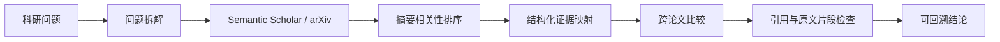

# Research Evidence Agent

一个面向科研问题的可追溯文献证据分析原型。系统将问题拆成检索角度，从 Semantic Scholar 和 arXiv 获取真实论文摘要，筛选相关记录，生成结构化证据卡与跨论文比较表，并在展示结论前检查引用编号和原文片段是否匹配。

## 解决的问题

- 文献入口分散，需要重复搜索和整理。
- 不同论文的方法、条件和结论缺少统一比较维度。
- 生成式模型可能给出没有来源支撑的判断，或把证据关联到错误论文。

## 工作流



工作流由 LangGraph 编排，包含 `question_frame`、`source_harvest`、`abstract_ranking`、`evidence_mapping`、`cross_study_view` 和 `citation_audit` 六个步骤。

## 当前能力

- 根据自然语言科研问题生成 2～3 个英文检索角度。
- 聚合 Semantic Scholar 与 arXiv 结果，并按 DOI 或标准化标题去重。
- 使用 TF-IDF 对标题和摘要进行轻量相关性排序。
- 提取研究方法、核心机制、实验条件、关键证据和研究局限。
- 输出跨论文比较表和带来源编号的结论。
- 拒绝不存在的论文编号、空结论和无法在对应摘要中定位的证据片段。
- Semantic Scholar 匿名请求被限流时自动退避，并保留其他来源结果。

## 技术栈

- Python 3.10+
- LangGraph
- Streamlit
- OpenAI-compatible Chat Completions API
- HTTPX
- scikit-learn

## 本地运行

```powershell
git clone https://github.com/Coco-o23/research-evidence-agent.git
cd research-evidence-agent

python -m venv .venv
.venv\Scripts\Activate.ps1
pip install -e ".[test]"

Copy-Item .env.example .env
```

编辑 `.env`：

```dotenv
OPENAI_API_KEY=your_api_key
OPENAI_BASE_URL=https://your-openai-compatible-endpoint/v1
OPENAI_MODEL=your_model_name
SEMANTIC_SCHOLAR_API_KEY=
```

启动页面：

```powershell
python -m streamlit run research_console.py
```

默认地址为 `http://localhost:8501`。

## 测试

```powershell
pytest tests -q
```

当前测试覆盖摘要去重、引用错配、虚构证据片段、空结论和离线端到端工作流。

## 项目结构

```text
research-evidence-agent/
├── research_console.py              # Streamlit 交互页面
├── evidence_pipeline.py             # 检索、抽取、比较与校验流程
├── eval_cases.json                  # 可靠性评测场景
├── product-brief.md                 # 产品范围与设计说明
├── tests/
│   └── test_evidence_pipeline.py
├── .env.example
└── pyproject.toml
```

## 证据边界

当前版本只分析检索接口返回的摘要。摘要没有披露的信息会标记为“未报告”；通过校验表示引用编号和原文片段能够对应，不等同于完成语义蕴含、论文质量或研究真实性判断。下一阶段可以加入 PDF 全文解析、段落级向量检索、页码定位和人工标注评测集。

